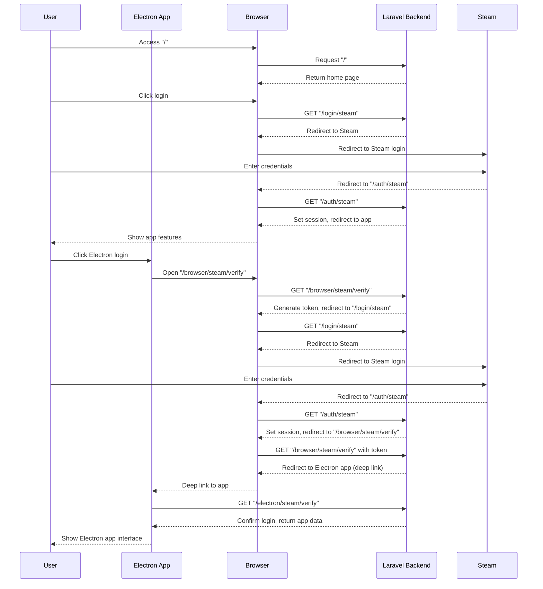

# Scarlet 


This is the Laravel API for Scarlet – Built by AAF.


## Getting Started

```bash
# Install
composer install

# Run
sail up -d
sail npm i
```

## Testing

```bash
# Feature Tests
sail test
```

## Development



Then open http://localhost
